# Ghoti / Super-AI-Agent

Ghoti is a local-first, approval-gated AI operating workspace for supervised demos, safe provider/tool intake, reviewable artifacts, and portfolio-grade engineering workflows.

**License posture:** Source visible for demonstration and review. Not open source unless a license change says otherwise. See [LICENSE](LICENSE).

**Commit attribution:** commits are kept human-authored; AI co-author trailers are not used unless the owner explicitly changes that policy.

<p align="center">
  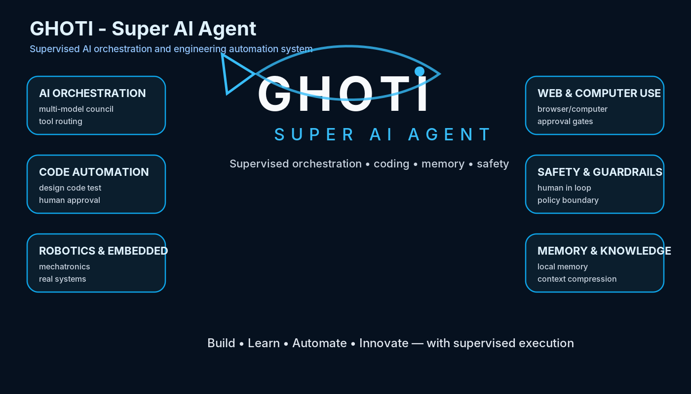
</p>

## Quickstart

Current clean main baseline: **N+5.9B / CLEAN PASS / GEMMA READINESS AND
LOCAL QUALITY PLAN LANDED ON MAIN**.

Current feature/audit lane: **N+6.0A / HUMAN-APPROVED GEMMA INSTALL + FIRST
LOCAL EVALUATION READY**. N+6.0A is intentionally feature/audit only until a
future merge gate lands it on main.

Previous clean baseline preserved for audit continuity: **N+5.6B /
clean/local-model-easy-worker-lane on main** at
`c9413108006d920e0110413d3d5e195b504489c1`.

```text
origin/main = 20e1dce1e89f15a337054864560b95b82233877c
N+4: 329 OK
N+5: 97 OK
N+6: 5 OK
Public audit: 150 checks / 0 blockers / 7 warnings on the N+6.0A audit branch
```

```powershell
python 03_scripts/ghoti_product_launcher.py --start-dashboard --open-dashboard
```

Dashboard URL:

```text
http://127.0.0.1:3210
```

Daily guide:

- [Daily Operator Guide](docs/DAILY_OPERATOR_GUIDE.md)
- [Local Memory Context Pack Guide](docs/LOCAL_MEMORY_CONTEXT_PACK_GUIDE.md)
- [Local Model / Gemma Setup Guide](docs/LOCAL_MODEL_GEMMA_SETUP_GUIDE.md)
- [Easy Worker Lane Guide](docs/EASY_WORKER_LANE_GUIDE.md)
- [Gemma Model Install Decision](docs/GEMMA_MODEL_INSTALL_DECISION.md)
- [Human-Approved Gemma Install Log](docs/HUMAN_APPROVED_GEMMA_INSTALL_LOG.md)
- [Local Model Quality Evaluation Guide](docs/LOCAL_MODEL_QUALITY_EVALUATION_GUIDE.md)
- [Repo Knowledge Map Guide](docs/REPO_KNOWLEDGE_MAP_GUIDE.md)
- [Graphify Repo Knowledge Roadmap](docs/GRAPHIFY_REPO_KNOWLEDGE_ROADMAP.md)
- [Hermes Agent Workflow Guide](docs/HERMES_AGENT_WORKFLOW_GUIDE.md)
- [Hermes Manual Provider Setup Checklist](docs/HERMES_MANUAL_PROVIDER_SETUP_CHECKLIST.md)
- [Hermes Skills Index Guide](docs/HERMES_SKILLS_INDEX_GUIDE.md)
- [Hermes Browser / Playwright Remediation Plan](docs/HERMES_BROWSER_PLAYWRIGHT_REMEDIATION_PLAN.md)
- Status: `python 03_scripts/ghoti_product_launcher.py --status --json`
- Smoke: `python 03_scripts/ghoti_product_launcher.py --smoke --json`
- Context pack: `python 03_scripts/ghoti_context_pack_builder.py --write --json`
- Local worker status: `python 03_scripts/ghoti_product_launcher.py --local-worker-status --json`
- Local worker demo: `python 03_scripts/ghoti_product_launcher.py --local-worker-demo --json`
- Gemma readiness: `python 03_scripts/ghoti_product_launcher.py --gemma-status --json`
- Gemma doctor: `python 03_scripts/ghoti_product_launcher.py --gemma-doctor --json`
- Gemma quality plan: `python 03_scripts/ghoti_product_launcher.py --gemma-quality-plan --json`
- Local model eval: `python 03_scripts/ghoti_product_launcher.py --local-model-eval --json`
- Repo map: `python 03_scripts/ghoti_product_launcher.py --repo-map --json`
- Next bundle: `python 03_scripts/ghoti_product_launcher.py --repo-bundle next-milestone --json`
- Hermes bridge status: `python 03_scripts/ghoti_product_launcher.py --hermes-bridge-status --json`
- Hermes bridge write: `python 03_scripts/ghoti_product_launcher.py --hermes-bridge-write --json`
- Stop: `python 03_scripts/ghoti_product_launcher.py --stop-dashboard`

## What Ghoti Can Do Now

- Run local dashboard/product demos.
- Show Start Here / Daily Operator, Status Truth, What Works Now, What Remains,
  Safety Locks, and Ask Codex Next on the dashboard.
- Generate compact local memory context packs for ChatGPT, Codex, Claude, and
  Obsidian under `14_context/compact_memory/generated/`.
- Inspect Ollama/Gemma truth and generate deterministic local worker demo
  outputs under `14_context/local_worker/generated/`.
- Show Gemma readiness, manual install decision, and local task quality plan
  under `14_context/local_model_readiness/generated/`.
- Record a human-approved Gemma preflight and first local quality evaluation
  under `14_context/local_model_evaluation/runs/`.
- Generate a local repo knowledge map, latest report index, subsystem index,
  task bundles, and a focused next prompt under `14_context/repo_knowledge/generated/`.
- Generate Hermes manual bridge readiness files, skills index, setup checklist,
  and bridge packet under `14_context/hermes_workflow/generated/`.
- Generate supervised content studio artifacts and preview packages.
- Validate the local content demo: 8 agents, 100 titles, 100 thumbnails, local
  preview, approval packet, no posting.
- Coordinate Claude Code implementation lanes and Codex audit lanes when both are available.
- Run approved adapter demos that create local artifacts only.
- Track external tool sandboxes without executing external repo code by default.
- Prepare Hermes local bootstrap reports without paid VPS requirements.
- Maintain public repo readiness, security checks, portfolio docs, and curated images.
- Surface latest reports under `14_context/`.

## Near-Term Roadmap Priority

Ivan's current priority is to reduce paid credit usage while preparing Ghoti
for long, boring supervised tasks that are simple one-by-one but advanced as a
workflow. The safe order is:

1. N+6.1A - constrained Gemma worker routing with a repo-bundle hallucination
   guard. Allowed tasks are summaries, status paragraphs, Codex prompts, safety
   classification, context-bundle summaries, next milestone outlines, and
   report-to-bullets only.
2. N+6.2A - Hermes Agent Workflow / Manual Bridge Verification for faster task
   execution. Safe probes only; no tokens, provider setup, Telegram setup, live
   APIs, or browser automation.
3. N+6.3A - Safe Computer-Use Preparation with Gemma, Hermes, UI-TARS
   observation, Browser Harness, and Vercel agent-browser roadmap. Observation
   comes first, and every click/type/live-account action remains human-approved.

N+6.1A must not execute commands or edit files from model output. It must use
known repo-map bundle IDs only, reject invented bundle or file claims, require
source metadata, and fall back to `local_demo` when the guard fails.

## Hermes Local Bootstrap

Hermes Agent is installed in Ubuntu WSL for the current local MVP, but Ghoti
stays local-first and safe.

- Official installer URL is documented in [docs/HERMES_LOCAL_INSTALL_AND_PROVIDER_PLAN.md](docs/HERMES_LOCAL_INSTALL_AND_PROVIDER_PLAN.md).
- `03_scripts/hermes_local_bootstrap.py` can check prerequisites, download the installer for inspection, hash it, and write reports.
- Actual installer execution is guarded because this milestone does not install packages or run external installer code automatically.
- Current verified WSL path: `/home/ai_sandbox/.local/bin/hermes`.
- Current verified version: `Hermes Agent v0.14.0`.
- Browser/Playwright is degraded/not claimed unless a later local Hermes check verifies it.
- Windows PowerShell users should use `curl.exe`, not the `curl` alias.
- The target machine is the Windows `ai_sandbox` profile.
- If using Ubuntu WSL, check the exact distro with `wsl -d Ubuntu` or
  `wsl.exe -d Ubuntu`.
- If Ubuntu opens but Hermes is not found, the installer was not completed
  inside Ubuntu yet; after reviewing the installer, run:
  `curl -fsSL https://hermes-agent.nousresearch.com/install.sh | bash -s -- --skip-setup`,
  then `source ~/.bashrc`, `command -v hermes`, and `hermes --help`.
- Bash from PowerShell can route to WSL on some machines, so explicit
  `wsl -d Ubuntu` is preferred for troubleshooting.
- No paid VPS currently.
- Telegram setup is later/manual; no Telegram token or chat ID is committed.
- Hermes Codex provider support is pending / not verified until local Hermes commands or official docs confirm it.

```powershell
python 03_scripts/hermes_local_bootstrap.py --status --json
python 03_scripts/hermes_local_bootstrap.py --check-prereqs --json
python 03_scripts/hermes_local_bootstrap.py --print-windows-commands
```

## Hermes Agent / Manual Bridge

N+5.8A adds a safe Hermes readiness lane without live setup:

```powershell
python 03_scripts/hermes_agent_workflow_bridge.py --status --json
python 03_scripts/hermes_agent_workflow_bridge.py --doctor --json
python 03_scripts/hermes_agent_workflow_bridge.py --skills-index --json
python 03_scripts/hermes_agent_workflow_bridge.py --write-readiness --json
python 03_scripts/ghoti_product_launcher.py --hermes-bridge-status --json
python 03_scripts/ghoti_product_launcher.py --hermes-bridge-write --json
```

Generated files:

- `14_context/hermes_workflow/generated/hermes_workflow_status.json`
- `14_context/hermes_workflow/generated/hermes_workflow_status.md`
- `14_context/hermes_workflow/generated/hermes_skills_index.md`
- `14_context/hermes_workflow/generated/hermes_manual_setup_checklist.md`
- `14_context/hermes_workflow/generated/hermes_operator_bridge_packet.md`

Current truth: Hermes core is installed in WSL and skills are safely
inspectable. Codex provider support remains pending/not proven, Telegram is
manual later/no token, browser/Playwright is degraded/not claimed, and no VPS
is required. The bridge uses safe probes only and does not run live provider
setup.

## Model Council Roadmap

Ghoti keeps provider planning explicit:

- Codex: preferred audit/verification lane and preferred Hermes provider if support is verified later.
- Claude Code: implementation lane when available.
- ChatGPT/Claude: planning, product reasoning, and source-intelligence lanes when manually invoked.
- Gemma/Ollama: cheap local worker brains for summarization and classification.
- Graphify: future external knowledge graph/token-efficiency candidate; current
  repo knowledge map is local JSON/Markdown only.
- Agent-browser and Browser Harness: future compliant browser QA candidates.

No ChatGPT, Claude, Codex, Hermes, Gemma, or browser tool is launched automatically by Ghoti.

## Local Memory And Context Packs

Ghoti can generate a small current context pack so Ivan can move between
ChatGPT, Codex, Claude, and Obsidian without replaying the whole repo history.

```powershell
python 03_scripts/ghoti_context_pack_builder.py --write --json
python 03_scripts/ghoti_product_launcher.py --context-pack --json
```

Generated files:

- `14_context/compact_memory/generated/ghoti_current_context_pack.md`
- `14_context/compact_memory/generated/ghoti_current_context_pack.json`
- `14_context/compact_memory/generated/ghoti_codex_next_prompt.md`
- `14_context/compact_memory/generated/ghoti_chatgpt_migration_summary.md`
- `14_context/compact_memory/generated/ghoti_status_short.md`

The builder is repo-local, excludes secrets, does not read `.env` contents, and
does not call live providers.

## Local Model / Easy Worker Lane

N+5.6A adds a safe local worker lane for small offline tasks:

```powershell
python 03_scripts/local_model_worker_lane.py --status --json
python 03_scripts/local_model_worker_lane.py --doctor --json
python 03_scripts/local_model_worker_lane.py --demo-task status-paragraph --json
python 03_scripts/local_model_worker_lane.py --write-demo-output --json
python 03_scripts/ghoti_product_launcher.py --local-worker-status --json
python 03_scripts/ghoti_product_launcher.py --local-worker-demo --json
```

Generated files:

- `14_context/local_worker/generated/local_worker_status.json`
- `14_context/local_worker/generated/local_worker_status.md`
- `14_context/local_worker/generated/latest_report_summary.md`
- `14_context/local_worker/generated/status_paragraph.md`
- `14_context/local_worker/generated/codex_next_prompt_from_context.md`

Current Ollama/Gemma truth:

- Ollama is available in the verified local baseline: `ollama version is 0.24.0`.
- N+6.0A ran the human-approved local command `ollama pull gemma3:4b`; verify
  current model presence with `ollama list`.
- If `gemma3:4b` is present, local worker status reports `ollama_gemma`.
- `local_demo` fallback remains available and must be used whenever the model is
  missing, weak, too slow, or unsafe for a task.
- Local model reachability never means local models drive operator actions.
- Ghoti shows the manual command `ollama pull gemma3:4b`, but never runs it
  automatically outside the explicit N+6.0A human-approved pull. No live APIs
  and no provider setup.

## Gemma Readiness And Quality Plan

N+5.9A adds a Gemma readiness decision lane:

```powershell
python 03_scripts/gemma_model_readiness.py --status --json
python 03_scripts/gemma_model_readiness.py --doctor --json
python 03_scripts/gemma_model_readiness.py --recommend --json
python 03_scripts/gemma_model_readiness.py --quality-plan --json
python 03_scripts/gemma_model_readiness.py --local-model-eval --json
python 03_scripts/gemma_model_readiness.py --write-evaluation --json
python 03_scripts/gemma_model_readiness.py --write-readiness --json
python 03_scripts/ghoti_product_launcher.py --gemma-status --json
python 03_scripts/ghoti_product_launcher.py --gemma-doctor --json
python 03_scripts/ghoti_product_launcher.py --gemma-quality-plan --json
python 03_scripts/ghoti_product_launcher.py --local-model-eval --json
```

Gemma readiness is local-only. It checks Ollama, lists installed models, reports
whether `gemma3:4b` or lighter alternatives are installed, and writes manual
decision files. It does not run `ollama pull`, call live APIs, use provider
tokens, or enable production routing. If Gemma is missing, `local_demo` fallback
remains active.

N+6.0A adds the **Human-approved Gemma install** and first local evaluation
packet. The only approved install command for that milestone is
`ollama pull gemma3:4b`; Ghoti records preflight and evaluation files but keeps
production routing disabled. If the pull fails or Gemma is absent, the eval
truthfully reports controlled `local_demo` fallback instead of claiming real
model quality. In the current N+6.0A run, `gemma3:4b` installed successfully and
the first real local evaluation scored 86% with 6 of 7 tasks passing; one
repo-bundle task hallucinated, so routing remains blocked.

Generated files:

- `14_context/local_model_readiness/generated/gemma_readiness_status.md`
- `14_context/local_model_readiness/generated/gemma_install_decision.md`
- `14_context/local_model_readiness/generated/gemma_manual_commands.md`
- `14_context/local_model_readiness/generated/local_task_quality_plan.md`
- `14_context/local_model_readiness/generated/local_task_quality_rubric.json`
- `14_context/local_model_evaluation/runs/<timestamp>_gemma_preflight/`
- `14_context/local_model_evaluation/runs/<timestamp>_gemma3_4b_quality_eval/`

## Repo Knowledge / Graphify Lane

N+5.7A adds a local repo knowledge lane for targeted context retrieval:

```powershell
python 03_scripts/ghoti_repo_knowledge_map.py --status --json
python 03_scripts/ghoti_repo_knowledge_map.py --write --json
python 03_scripts/ghoti_repo_knowledge_map.py --bundle next-milestone --json
python 03_scripts/ghoti_product_launcher.py --repo-map --json
python 03_scripts/ghoti_product_launcher.py --repo-bundle next-milestone --json
```

Generated files:

- `14_context/repo_knowledge/generated/repo_knowledge_map.json`
- `14_context/repo_knowledge/generated/repo_knowledge_map.md`
- `14_context/repo_knowledge/generated/latest_reports_index.md`
- `14_context/repo_knowledge/generated/subsystem_index.md`
- `14_context/repo_knowledge/generated/task_bundle_next_milestone.md`
- `14_context/repo_knowledge/generated/codex_next_prompt_graph_context.md`
- `14_context/repo_knowledge/generated/chatgpt_repo_context_summary.md`

Current truth: repo knowledge readiness is 55%. The local map and task bundles
work now. External Graphify runtime is roadmap only/not wired, with no external
repo runtime and no network.

## Public Repo And Portfolio Lane

Public polish is a side lane, not the whole project. See:

- [GitHub profile and repo upgrade playbook](docs/GITHUB_PROFILE_AND_REPO_UPGRADE_PLAYBOOK.md)
- [Repo branding and image playbook](docs/REPO_BRANDING_AND_IMAGE_PLAYBOOK.md)
- [Public release security checklist](docs/PUBLIC_RELEASE_SECURITY_CHECKLIST.md)

Fast wins: pin NXP/SDA/Doodle/Ghoti plus two strong repos, add topics, add demo GIFs, add Actions, and create portfolio releases.

Every important repo should have a branded image/banner/diagram. Ghoti should later be renamed to include "Ghoti" clearly, for example `Super-AI-Agent-Ghoti`, `Ghoti-Super-AI-Agent`, or `Ghoti-Agent-OS`.

## Image Tour

Curated assets are copied from `Human Placed Stuff/` into `docs/assets/github/` after review. Raw imports remain ignored.

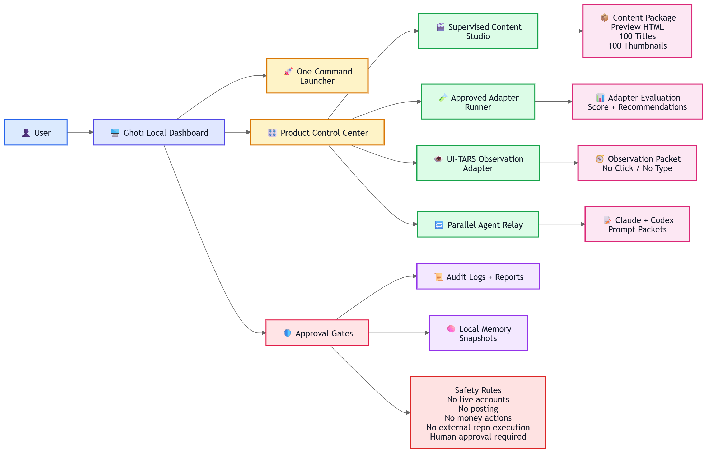

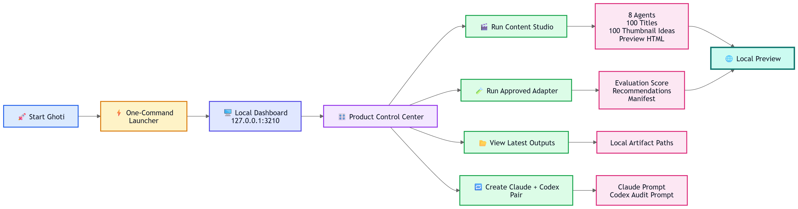

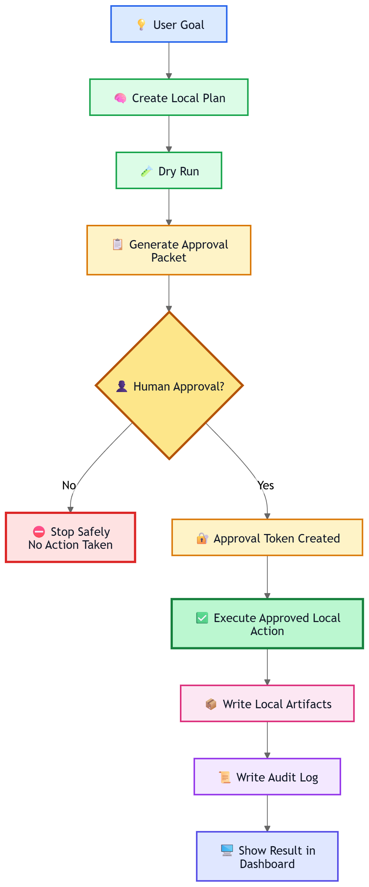

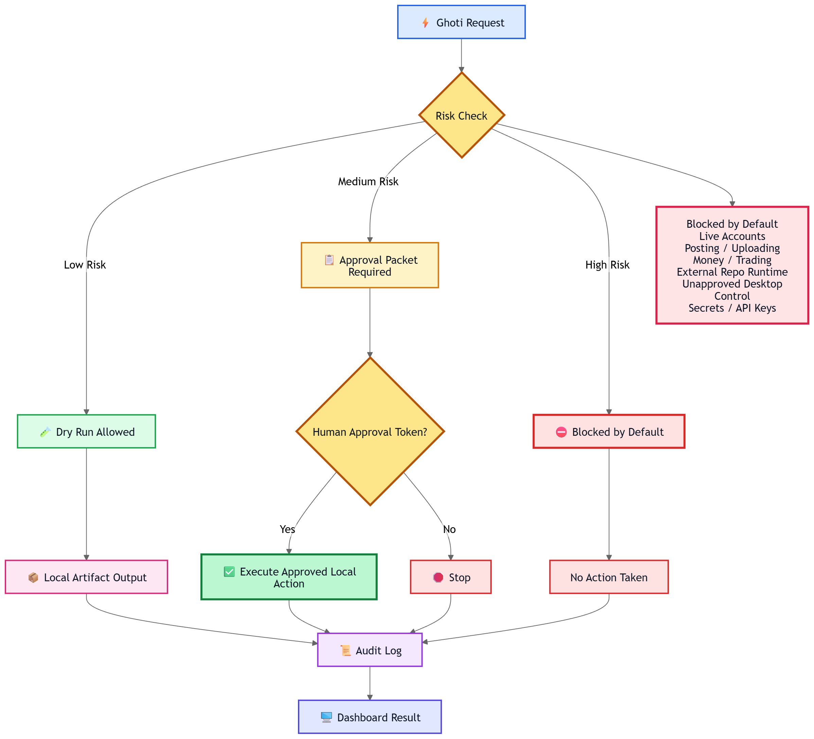

## Safety Model

- UI-TARS remains observation-only; no click/type/control is enabled.
- Hermes WSL install is claimed only from local command evidence.
- Hermes Codex provider support is not claimed until verified.
- Telegram is not connected.
- No running VPS is part of this setup.
- No live account automation, posting, trading, money movement, legal action, or public action is enabled.
- External repo runtime wiring is not enabled by default.
- Bot-detection bypass, captcha bypass, fake engagement, spam, account abuse, unauthorized scraping, credential theft, and unauthorized desktop control are blocked.
- Codex work must use repo-contained `.claude/worktrees/`; no primary worktree mutation except read-only inspection.
- no live providers/tokens setup is part of the daily workflow.

## Public Security Audit

```powershell
python 03_scripts/public_repo_security_audit.py --write-report --json
```

The audit reports `total_checks`, blockers, warnings, `safe_to_make_public`, and `human_review_required`.

## Mermaid Diagrams

### Ghoti System Architecture

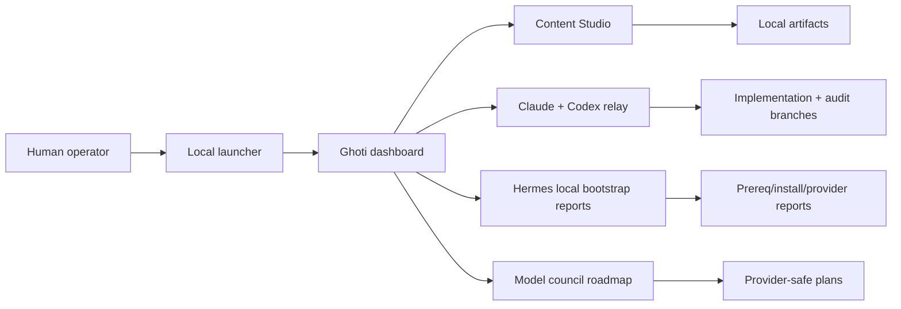

### Hermes Local Bootstrap Flow

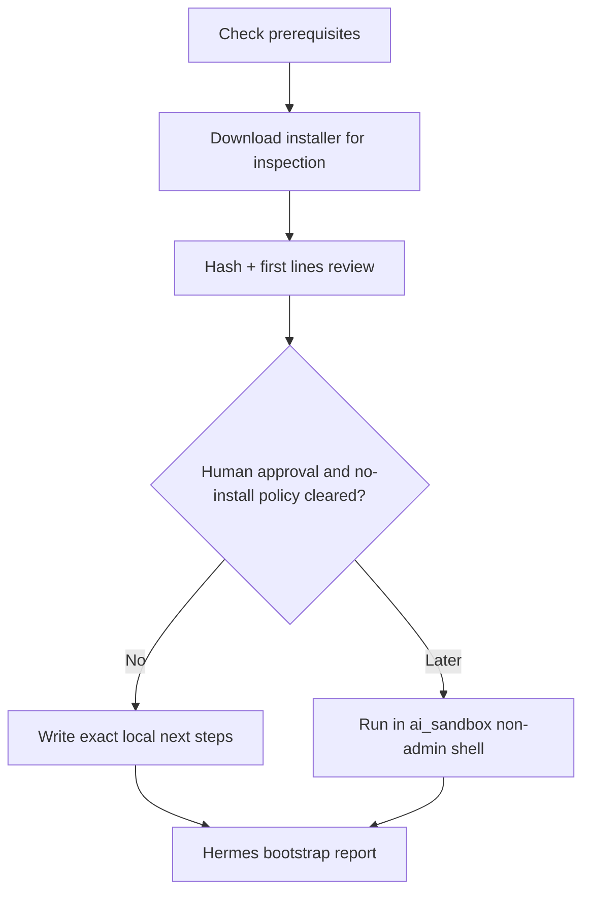

### Model Council Provider Routing

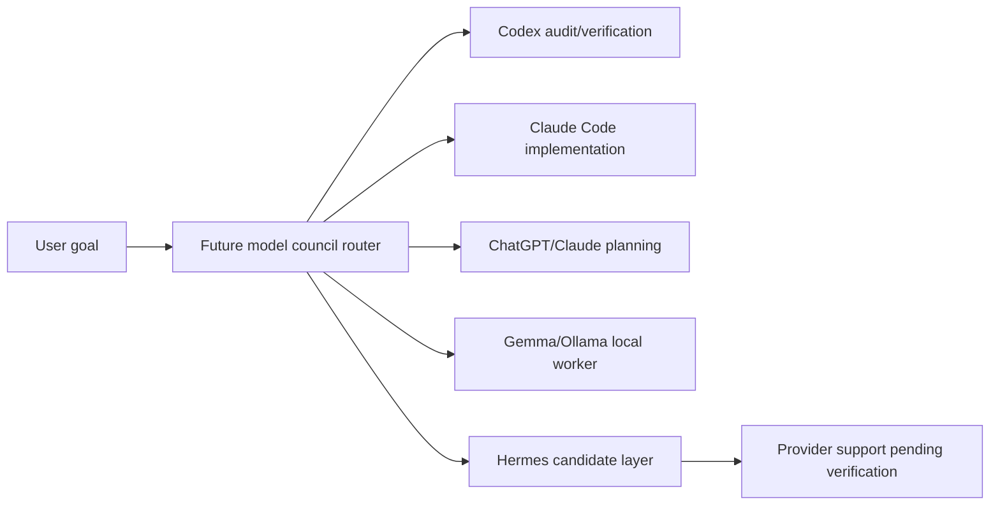

### Token-Efficient Work Routing

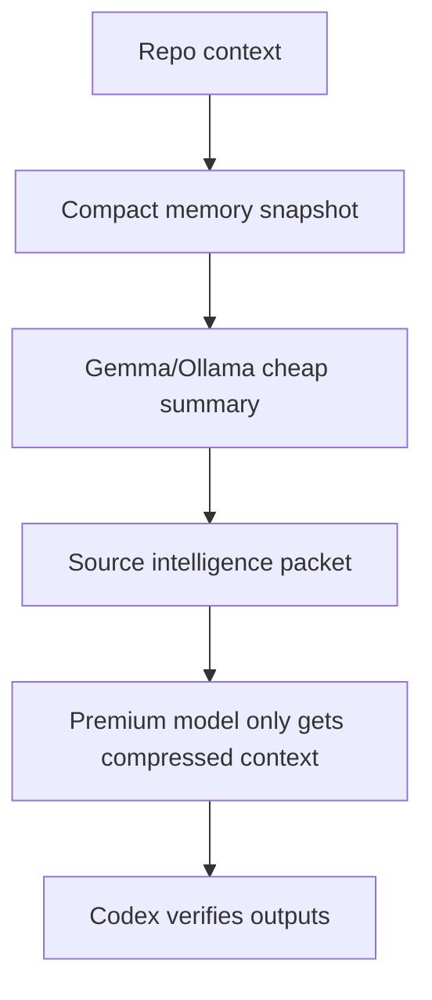

### Human Approval Gate Flow

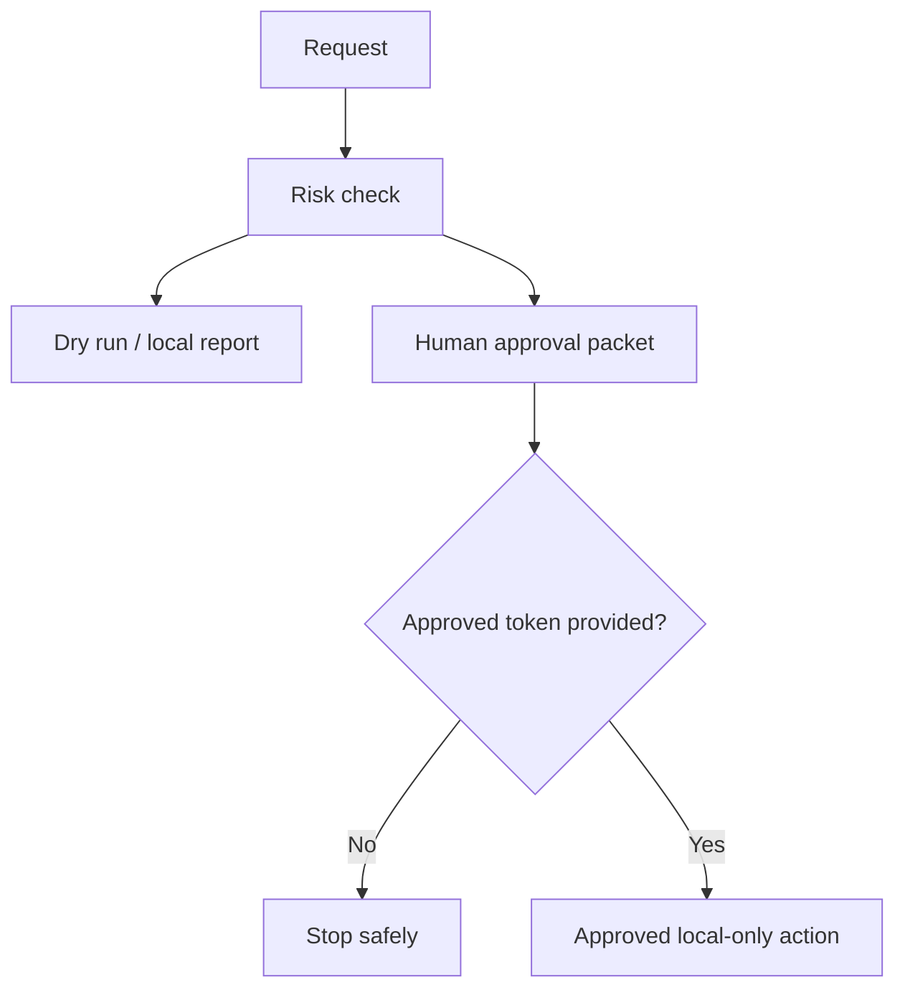

### Portfolio Repo Upgrade Flywheel

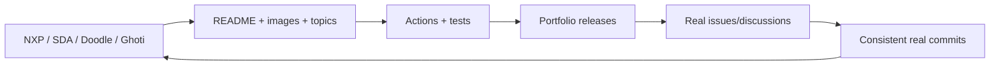

### Safety Model

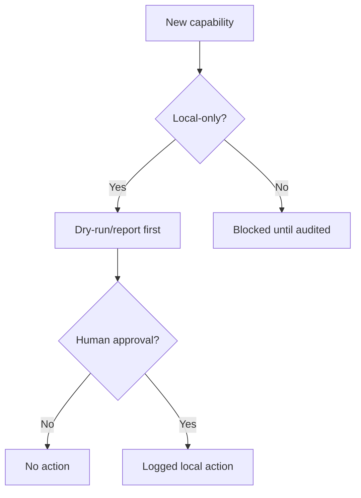

## Current Limitations

- Hermes browser/Playwright is not claimed working.
- Hermes provider support for Codex is pending / not verified.
- Telegram setup requires manual token/chat setup from the user.
- Graphify is not installed or working in this repo yet.
- agent-browser and Browser Harness are not runtime-wired.
- Gemma model availability is pending; Ollama exists but local_demo fallback is active when Gemma is missing.
- Gemma/Ollama does not control the system.
- This repo is public-facing but not open source.
