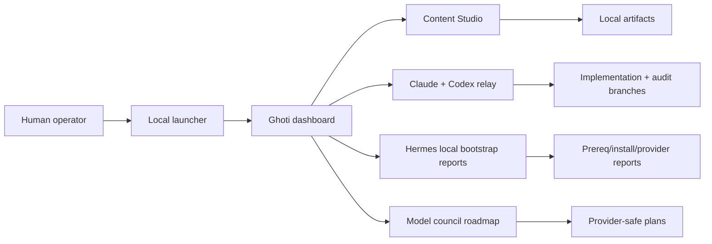
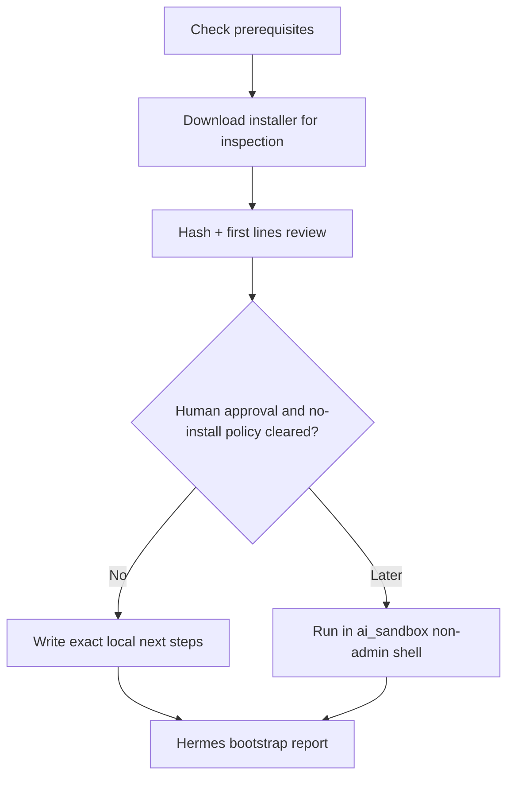
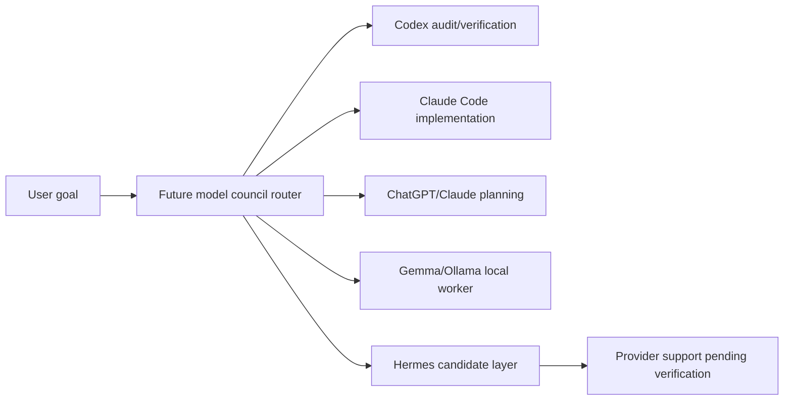
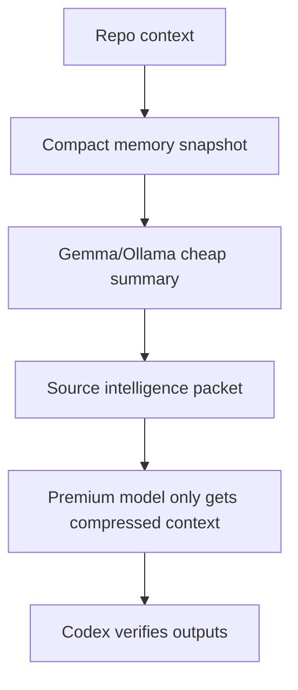
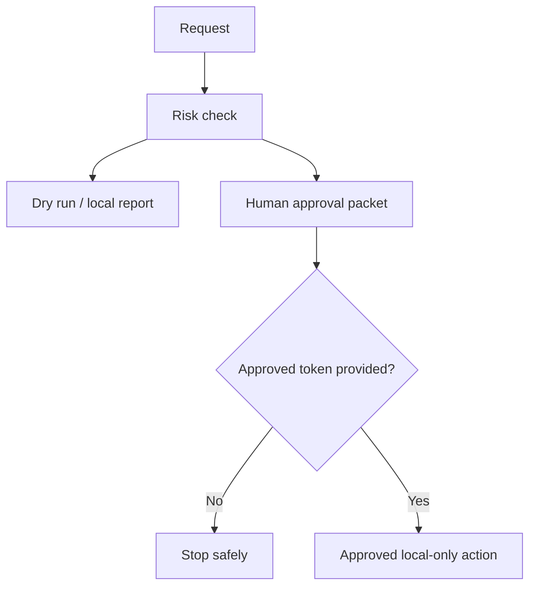
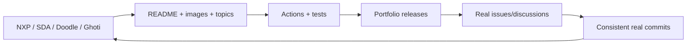
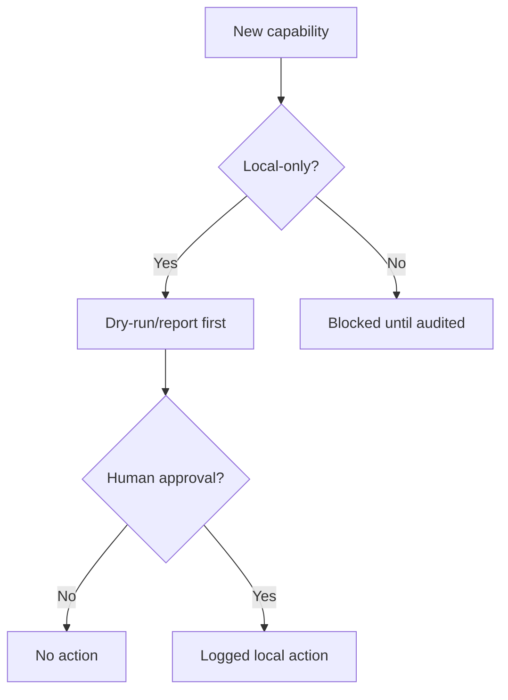

# Ghoti / Super-AI-Agent

Ghoti is a local-first, approval-gated AI operating workspace for supervised demos, safe provider/tool intake, reviewable artifacts, and portfolio-grade engineering workflows.

**License posture:** Source visible for demonstration and review. Not open source unless a license change says otherwise. See [LICENSE](LICENSE).

**Commit attribution:** commits are kept human-authored; AI co-author trailers are not used unless the owner explicitly changes that policy.

<p align="center">
  
</p>

## Quickstart

```powershell
python 03_scripts/ghoti_product_launcher.py --start-dashboard --open-dashboard
```

Dashboard URL:

```text
http://127.0.0.1:3210
```

## What Ghoti Can Do Now

- Run local dashboard/product demos.
- Generate supervised content studio artifacts and preview packages.
- Coordinate Claude Code implementation lanes and Codex audit lanes when both are available.
- Run approved adapter demos that create local artifacts only.
- Track external tool sandboxes without executing external repo code by default.
- Prepare Hermes local bootstrap reports without paid VPS requirements.
- Maintain public repo readiness, security checks, portfolio docs, and curated images.

## Hermes Local Bootstrap

Hermes Agent is now a priority, but Ghoti stays local-first and safe.

- Official installer URL is documented in [docs/HERMES_LOCAL_INSTALL_AND_PROVIDER_PLAN.md](docs/HERMES_LOCAL_INSTALL_AND_PROVIDER_PLAN.md).
- `03_scripts/hermes_local_bootstrap.py` can check prerequisites, download the installer for inspection, hash it, and write reports.
- Actual installer execution is guarded because this milestone does not install packages or run external installer code automatically.
- Windows PowerShell users should use `curl.exe`, not the `curl` alias.
- The target machine is the Windows `ai_sandbox` profile.
- No paid VPS currently.
- Telegram setup is later/manual; no Telegram token or chat ID is committed.
- Hermes Codex provider support is pending / not verified until local Hermes commands or official docs confirm it.

```powershell
python 03_scripts/hermes_local_bootstrap.py --status --json
python 03_scripts/hermes_local_bootstrap.py --check-prereqs --json
python 03_scripts/hermes_local_bootstrap.py --print-windows-commands
```

## Model Council Roadmap

Ghoti keeps provider planning explicit:

- Codex: preferred audit/verification lane and preferred Hermes provider if support is verified later.
- Claude Code: implementation lane when available.
- ChatGPT/Claude: planning, product reasoning, and source-intelligence lanes when manually invoked.
- Gemma/Ollama: cheap local worker brains for summarization and classification.
- Graphify: future knowledge graph/token-efficiency candidate.
- Agent-browser and Browser Harness: future compliant browser QA candidates.

No ChatGPT, Claude, Codex, Hermes, Gemma, or browser tool is launched automatically by Ghoti.

## Public Repo And Portfolio Lane

Public polish is a side lane, not the whole project. See:

- [GitHub profile and repo upgrade playbook](docs/GITHUB_PROFILE_AND_REPO_UPGRADE_PLAYBOOK.md)
- [Repo branding and image playbook](docs/REPO_BRANDING_AND_IMAGE_PLAYBOOK.md)
- [Public release security checklist](docs/PUBLIC_RELEASE_SECURITY_CHECKLIST.md)

Fast wins: pin NXP/SDA/Doodle/Ghoti plus two strong repos, add topics, add demo GIFs, add Actions, and create portfolio releases.

Every important repo should have a branded image/banner/diagram. Ghoti should later be renamed to include "Ghoti" clearly, for example `Super-AI-Agent-Ghoti`, `Ghoti-Super-AI-Agent`, or `Ghoti-Agent-OS`.

## Image Tour

Curated assets are copied from `Human Placed Stuff/` into `docs/assets/github/` after review. Raw imports remain ignored.


## Safety Model

- UI-TARS remains observation-only; no click/type/control is enabled.
- Hermes is not claimed as installed unless a local command verifies it.
- Hermes Codex provider support is not claimed until verified.
- Telegram is not connected.
- No running VPS is part of this setup.
- No live account automation, posting, trading, money movement, legal action, or public action is enabled.
- External repo runtime wiring is not enabled by default.
- Bot-detection bypass, captcha bypass, fake engagement, spam, account abuse, unauthorized scraping, credential theft, and unauthorized desktop control are blocked.

## Public Security Audit

```powershell
python 03_scripts/public_repo_security_audit.py --write-report --json
```

The audit reports `total_checks`, blockers, warnings, `safe_to_make_public`, and `human_review_required`.

## Mermaid Diagrams

### Ghoti System Architecture



### Hermes Local Bootstrap Flow



### Model Council Provider Routing



### Token-Efficient Work Routing



### Human Approval Gate Flow



### Portfolio Repo Upgrade Flywheel



### Safety Model



## Current Limitations

- Hermes local install is not claimed complete unless verified by local command output.
- Hermes provider support for Codex is pending / not verified.
- Telegram setup requires manual token/chat setup from the user.
- Graphify is not installed or working in this repo yet.
- agent-browser and Browser Harness are not runtime-wired.
- Gemma/Ollama does not control the system.
- This repo is public-facing but not open source.
