# Ghoti

Ghoti is a local-first, approval-gated AI operating workspace for building visible demos, generating reviewable artifacts, coordinating Claude + Codex work, and safely exploring future desktop/tool adapters.

**License posture:** Source visible for demonstration and review. Not open source unless a license change says otherwise. See [LICENSE](LICENSE).

## Quickstart

```powershell
python 03_scripts/ghoti_product_launcher.py --start-dashboard --open-dashboard
```

Dashboard URL:

```text
http://127.0.0.1:3210
```

The launcher prints the local dashboard URL, tracks its own PID, and stops only the recorded dashboard process.

## Image Tour

Curated screenshots/diagrams are copied into `docs/assets/github/` from the raw user-provided intake folder after human review. Raw imports are ignored and are not committed by default.


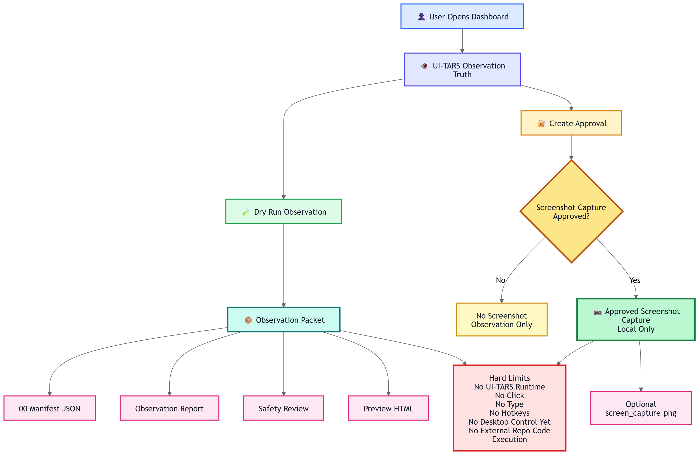


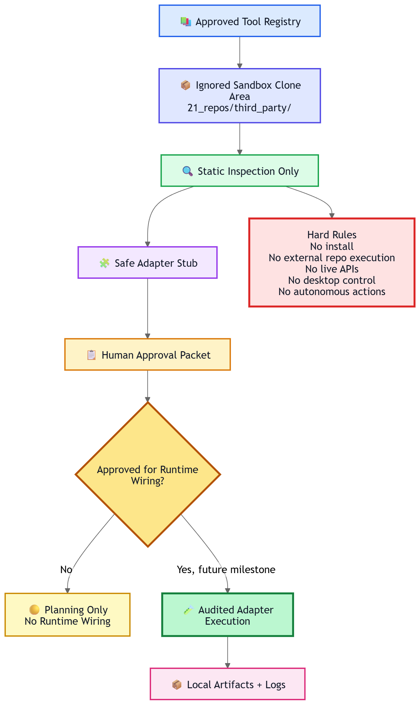

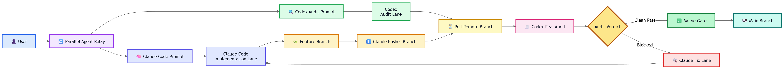

## What Ghoti Can Do Now

- Open a local dashboard control center.
- Run a supervised content studio demo that creates local preview files.
- Generate Claude + Codex paired prompt packets for manual copy/paste relay.
- Run an approved adapter demo for a safe local evaluation stub.
- Manage an external tool sandbox for static inspection and adapter discovery.
- Create UI-TARS observation packets in observation-only mode.
- Write local audit reports, manifests, safety reviews, and human approval packets.
- Run public-release readiness checks before any repository visibility change.

## Safety Model

Ghoti is intentionally conservative. The current system is local-first, dry-run-first, and approval-gated.

- UI-TARS status: observation only, no click/type/control yet.
- External sandbox status: static/sandboxed, no external repo code execution by default.
- Approved adapter execution status: local artifact generation only unless a human approval token authorizes a narrow safe action.
- No live account actions.
- No posting/uploading.
- No trading or money movement.
- No autonomous Claude/Codex launch.
- No external tool runtime wiring by default.
- Public release requires a clean security audit and human review.

## Public Repo Security

Before changing repository visibility, run:

```powershell
python 03_scripts/public_repo_security_audit.py --write-report --json
```

The audit writes to `14_context/security/public_repo_audits/<timestamp>/` and reports:

- `total_checks`
- `blocking_findings`
- `warning_checks`
- `safe_to_make_public`
- `human_review_required`

Likely secrets or private raw imports block public release. Ambiguous historical planning references are warnings for human review.

## Human Imported Stuff Policy

The raw user folder detected for this release is `Human Placed Stuff/`. It is treated as private intake and ignored. Safe public copies are curated into `docs/assets/github/` with sanitized filenames. Do not commit raw imports, private documents, account screenshots, school/CV files, or screenshots that show secrets.

See [docs/HUMAN_IMPORTED_STUFF_POLICY.md](docs/HUMAN_IMPORTED_STUFF_POLICY.md).

## Current Limitations

- Ghoti is not a general-purpose desktop controller.
- UI-TARS is not allowed to click, type, use hotkeys, or control the computer yet.
- External repos are not installed or executed by default.
- Live APIs/accounts are not part of the default demo path.
- Public visibility is not open-source permission.
- Human review is still required before making the repository public.

## Repository Description

Suggested GitHub repository description:

```text
Local-first, approval-gated AI operating workspace with dashboard demos, safety reports, Claude+Codex relay prompts, and sandboxed adapter exploration.
```

Suggested GitHub topics:

```text
ai-agent, local-first, safety, dashboard, codex, claude, approval-gates, tool-sandbox, automation-research
```

See the [GitHub presentation checklist](docs/GITHUB_PRESENTATION_CHECKLIST.md) for issue template, pull request template, topics, and release notes suggestions.

## Mermaid Diagrams

### Ghoti System Architecture

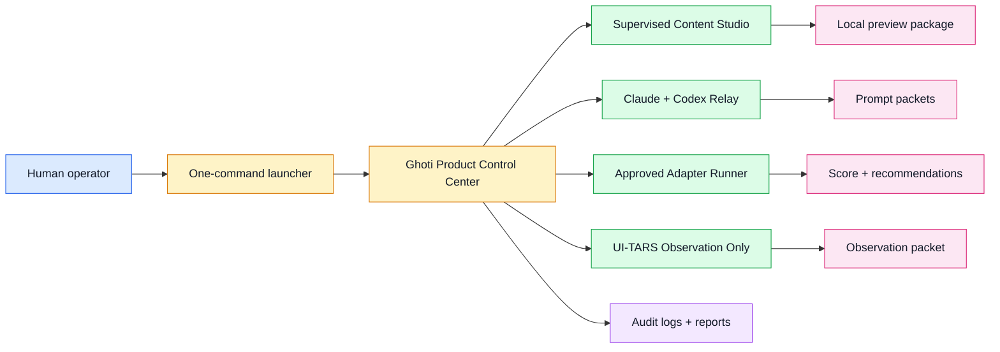

### Human Approval Gate Flow

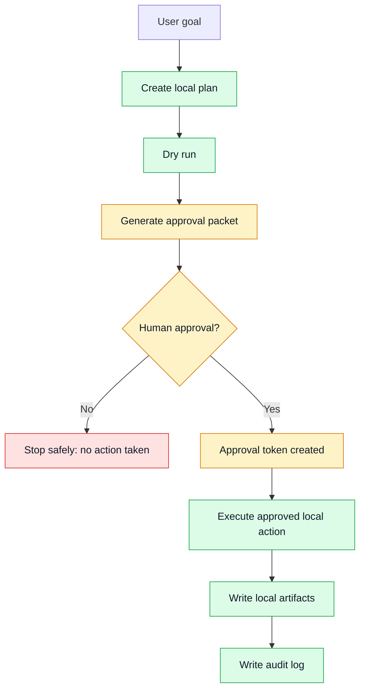

### Product Demo Workflow

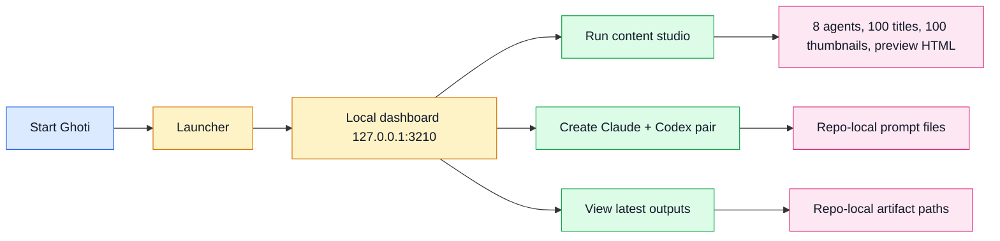

### External Tool Sandbox Flow

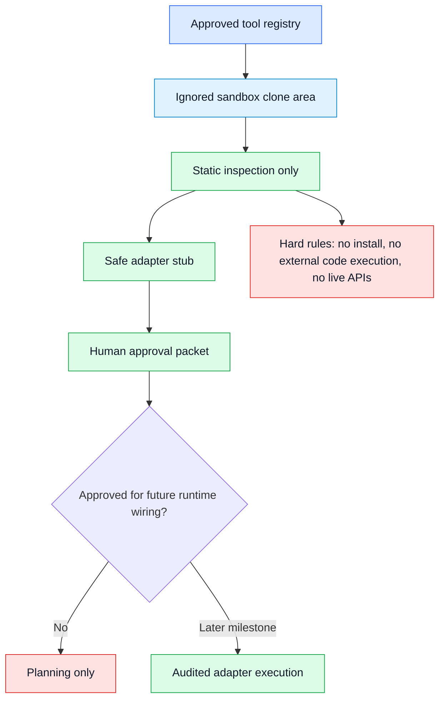

### UI-TARS Observation Flow

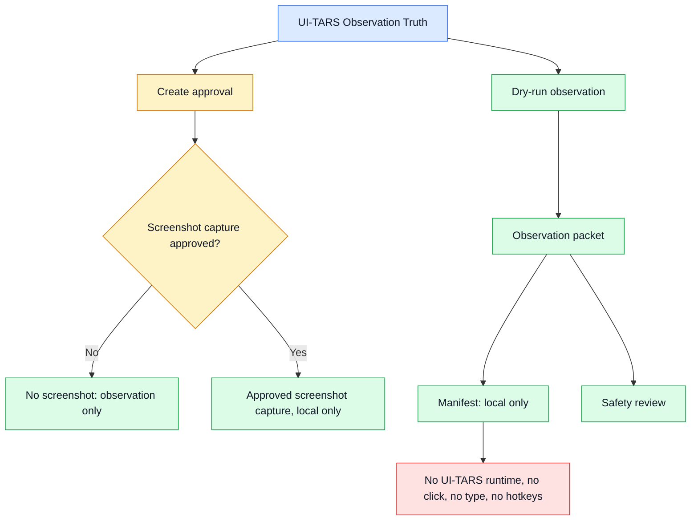

### Claude + Codex Parallel Relay

```mermaid
flowchart LR
  classDef user fill:#dbeafe,stroke:#2563eb,color:#111827;
  classDef relay fill:#f3e8ff,stroke:#9333ea,color:#111827;
  classDef lane fill:#dcfce7,stroke:#16a34a,color:#111827;
  classDef audit fill:#fce7f3,stroke:#db2777,color:#111827;
  classDef gate fill:#fef3c7,stroke:#d97706,color:#111827;
  User["User"]:::user --> Relay["Parallel Agent Relay"]:::relay
  Relay --> ClaudePrompt["Claude implementation prompt"]:::lane
  Relay --> CodexPrompt["Codex audit prompt"]:::lane
  ClaudePrompt --> ClaudeLane["Claude Code implementation lane"]:::lane
  CodexPrompt --> CodexLane["Codex audit lane"]:::lane
  ClaudeLane --> Branch["Feature branch pushed"]:::gate
  CodexLane --> Poll["Poll remote ref"]:::gate
  Branch --> Poll
  Poll --> Audit["Codex real audit"]:::audit
  Audit --> Verdict{"Audit verdict"}:::gate
  Verdict -- "Clean" --> Merge["Merge gate"]:::lane
  Verdict -- "Blocked" --> Fix["Fix lane"]:::audit
```

### Roadmap Timeline

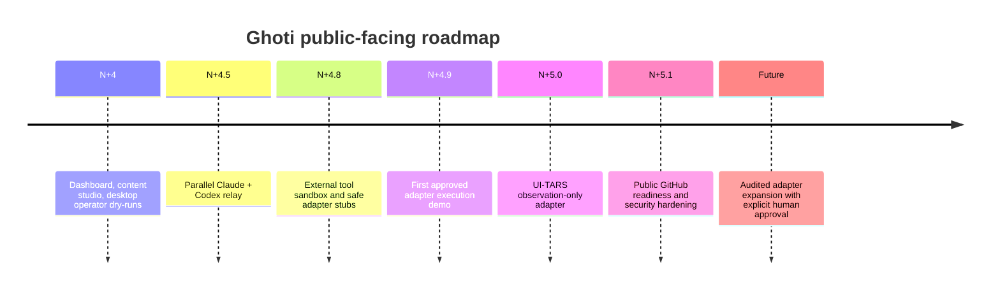

### Safety Model

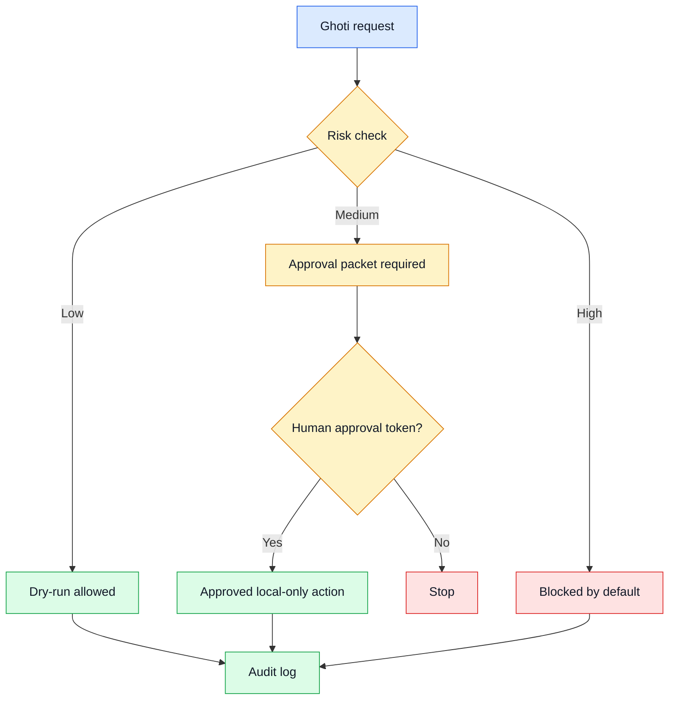

## Roadmap

- Keep the dashboard productized and understandable for non-maintainers.
- Continue adding tests before widening capabilities.
- Add public issue and pull request templates after human review.
- Keep external tool integrations behind sandbox, static inspection, and explicit approval.
- Consider an open-source license later only if the owner intentionally changes the license.

## Public Release Checklist

See [docs/PUBLIC_RELEASE_SECURITY_CHECKLIST.md](docs/PUBLIC_RELEASE_SECURITY_CHECKLIST.md). The short version:

1. Run the public repo security audit.
2. Review all blockers and warnings.
3. Inspect curated images.
4. Confirm no private raw imports are tracked.
5. Confirm the proprietary license posture is intentional.
6. Only then decide manually whether to change GitHub visibility.
